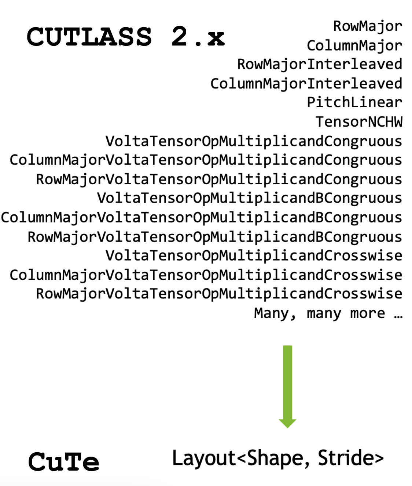

# Cutlass and CuTe Terminology Guide

**CUTLASS** A library that provides building blocks for matrix multiplication, convolution, and other tensor operations.

**CuTe** (CUDA Tensor Extensions) 
- Modern C++ templated library introduced with CUTLASS 3.0 
- It handles tensor layouts and data access patterns in a more abstract and flexible way

We will focus on the CUTLASS 3.0/CuTe Terminology because it's the latest, simplest and most used version especially for Hopper GPUs and newer architectures.


This diagram illustrates the relationship between key concepts in CUTLASS and CuTe that we'll explore in this guide.

## Fundamental Types

### Integers

- Dynamic Integers (define at runtime)
- Static Integers (defined at compile time, and can represented like `_1`, `_2`, `_3`, etc or `Int<1>{}`, `Int<2>{}`, `Int<3>{}`, etc)

### IntTuple
CuTe defines the IntTuple concept as either an integer, or a tuple of IntTuples. This recursive definition allows for representing complex nested structures of integers.

- `int{2}` - A dynamic integer with value 2
- `Int<3>{}` - A static integer with value 3 (known at compile time)
- `make_tuple(int{2}, Int<3>{})` - A tuple containing a dynamic-2 and a static-3
...

CuTe uses the IntTuple concept for various purposes including Shape, Stride, Coord ...
- mode : an element of the IntTuple can be a static or dynamic integer or a tuple of integers
- rank(IntTuple): Returns the number of elements in an IntTuple (number of modes)
  - A single integer has rank 1
  - A tuple has rank equal to tuple_size

- get&lt;i&gt;(IntTuple): Retrieves the i-th element of the IntTuple

- depth(IntTuple): Indicates the hierarchical nesting level
  - A single integer has depth 0
  - A tuple of integers has depth 1
  - A tuple containing a tuple of integers has depth 2, etc.

- size(IntTuple): Computes the product of all elements in the IntTuple

### Index & LongIndex

- **Index** is typically a 32-bit integer type used for addressing tensor elements in each dimension

- **LongIndex** is a 64-bit integer type used for addressing tensor elements offset from the base address

## Fundamental Data Structures

### Shape
**Shape** refers to the dimensions of a tensor.

**Example:** A matrix with 128 rows and 64 columns has a shape of `Shape<_128, _64>`.

### Stride
**Stride** defines the memory distance between adjacent elements in each dimension. It determines how to navigate the tensor in memory.

### Layout
**Layout** describes how tensor elements are arranged in memory. Different layouts can dramatically affect performance.
A `cute::Layout` type is composed of `cute::Shape` and `cute::Stride`

**Example: row-major layout**
```cpp
using ExampleLayout = cute::Layout<Shape<_3, _2>, Stride<_2, _1>>;
// in memory the layout would looke like : 
// 0 1
// 2 3
// 4 5

// 3 lines, 2 columns, 
// Stride = 2 for the first dimension (lines), 1 for the second dimension (columns)
```

**Example: column-major layout**
```cpp
using ExampleLayout = cute::Layout<Shape<_3, _2>, Stride<_1, _3>>;
// in memory the layout would looke like : 
// 0 3
// 1 4
// 2 5

// 3 lines, 2 columns, 
// Stride = 1 for the first dimension (lines), 3 for the second dimension (columns)
```

### Tensor
- **Tensor** is a multi-dimensional array of elements.
- In CuTe, tensors are represented by `cute::Tensor` type.
- Represented by a `cute::Layout` and a `cute::Engine`(the Engine holds the iterator)

### Fragment
**Fragment** is a data structure that holds a portion of a tensor temporarily in registers for each thread. 

## Core Abstractions

### Tile
**Tile** is is partition of a tensor that have constant dimensions and layout known at compile time

**Example:** A 128×128 matrix can be divided into 32×32 tiles for efficient parallel processing.

### Operation
**Operation** is a struct that exposes the PTX instruction for a specific operation, defining its expected arguments and interface. Each struct is named to reflect the MMA instruction it represents 

**Example:**
```cpp
// Defining a GEMM operation with specific tile size and data types
struct SM70_8x8x4_F16F16F16F16_TN
{
    // ...
};
```

### Trait
**Traits** define the meta-data for the operation. They're template structures that configure various aspects of kernels, including data types, tile sizes, ...

**Example:**
```cpp
struct MMA_Traits<SM70_8x8x4_F16F16F16F16_TN>
{
  using ValTypeD = half_t;
  using ValTypeA = half_t;
  using ValTypeB = half_t;
  using ValTypeC = half_t;

  using Shape_MNK = Shape<_8,_8,_4>;
  using ThrID   = SM70_QuadPair;
  using ALayout = SM70_8x4_Row;
  using BLayout = SM70_8x4_Row;
  using CLayout = SM70_8x8_16b;
};

```
### Atom
**Atom** combines an `Operation` and a `Trait`. It operates at various levels (thread, warp, warpgroup) and represents the smallest group of threads and data needed for executing a hardware-accelerated math or copy operation.

You can read this [tutorial](https://github.com/NVIDIA/cutlass/blob/main/media/docs/cute/0t_mma_atom.md) for in depth explanation


### Collective
**Collective** in CuTe refers to an operation performed collaboratively by a group of threads (like a warp or thread block). Collectives orchestrate multiple atoms to perform larger operations efficiently.

## GPU Architecture Concepts

### Warp
**Warp** is a group of 32 GPU threads that execute instructions in lockstep (SIMT - Single Instruction, Multiple Threads).

### Thread Block or CTA (Cooperative Thread Array)
**Thread Block** is a 3D collection of threads that can communicate and synchronize with each other using shared memory.

### SM (Streaming Multiprocessor)
**SM** is a core processing unit in NVIDIA GPUs that executes thread blocks.

## Memory Concepts

### Shared Memory
**Shared Memory** is a fast, on-chip memory accessible by all threads in a thread block. It's significantly faster than global memory but limited in size.

### Register
**Register** is the fastest memory in the GPU hierarchy, private to each thread.

### Global Memory
**Global Memory** is the largest but slowest memory accessible by all threads in a GPU.

### TMA (Tensor Memory Access)
**TMA** is a hardware feature introduced in NVIDIA Hopper architecture that accelerates tensor data movement between global and shared memory. It enables efficient and programmable tensor loads and stores.

## Programming Patterns

### Predication
**Predication** is a technique to handle boundary conditions by selectively enabling or disabling operations on specific elements.

**Example:** Using predication to ensure threads don't access out-of-bounds memory when processing the edges of a tensor.

### Fusion
**Fusion** combines multiple operations into a single kernel to reduce memory traffic and improve performance.

**Example:** Fusing GEMM with an activation function to avoid storing and reloading intermediate results.

### Epilogue
**Epilogue** is the final stage of operations like GEMM or convolution, applied after the main computation. It typically handles:
- Scaling the result
- Adding bias
- Applying activation functions
- Output type conversion


## Misc Concepts

### Tensor Core
**Tensor Core** is specialized hardware in NVIDIA GPUs for accelerating matrix multiplication operations.

### GEMM (General Matrix Multiply)
**GEMM** performs the operation C = alpha * A * B + beta * C, where A, B, and C are matrices.

### MMA (Matrix Multiply-Accumulate)
**MMA** is an instruction that performs matrix multiplication and accumulation in a single operation, often using Tensor Cores.

### GMMA (Group Matrix Multiply-Accumulate)
**GMMA** is an extension of MMA that operates on groups of matrices, introduced in newer GPU architectures.

### Swizzle
**Swizzle** refers to reordering elements to improve memory access patterns and avoid bank conflicts.

### NT and TN (Matrix Layouts)
- **N** means "Non-transposed" 
- **T** means "Transposed"

**NT** indicates that matrix A is non-transposed (N) and matrix B is transposed (T).
**TN** indicates that matrix A is transposed (T) and matrix B is non-transposed (N).

